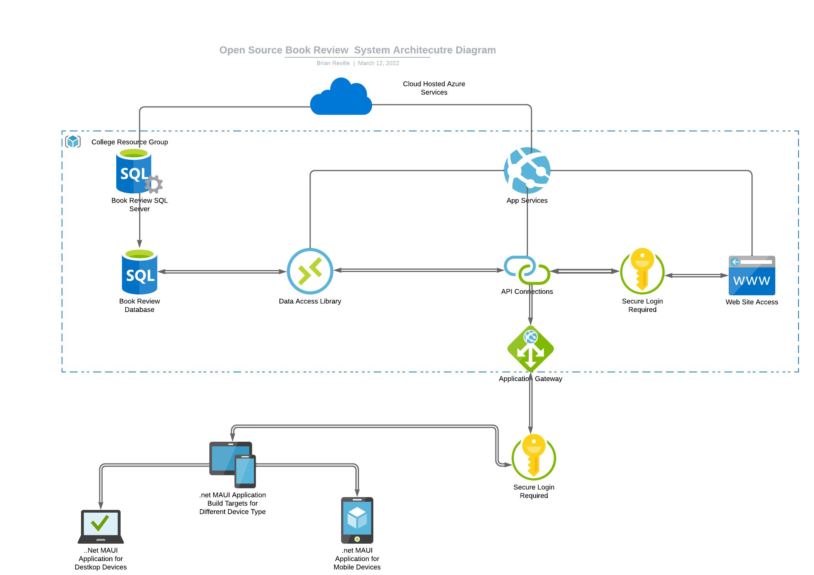
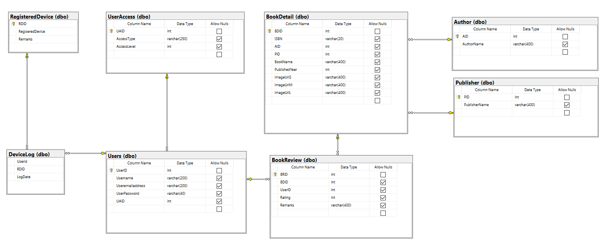

# OSBookReviewWepApi

Open Source Web App and Api for Book Review .Net Maui appilcation for College Project

## Project Overview

### Overall Project Architecture Diagram

### Wep Api Structure - (Diagram and Text Explaination)(TBC)

### Data Access Library -

Please see associated repository
[OS Data Access Library](https://github.com/brianreville/OSDataAccessLibrary)

### .Net MAUI

Please see associated repository
[OS Book Review .NET MAUI App ](https://github.com/brianreville/OSBookReviewMAUI)

### Database Structure - (ERM Image Displayed Below)

ERM Diagram

Database Set-Up Script and Stored Procedure Files saved in SampleDB Folder 
Sample Dataset Stored in SampleDB Folder for Upload to Database when Set Up Script Completed

### Additional Sources

Database Dataset - Sample Dataset Taken from Kaggle and then adjusted to fit designed db
[Kaggle Dataset](https://www.kaggle.com/arashnic/book-recommendation-dataset)

## How to run the project

1. First you should download [Visual Studio 2022 PREVIEW](https://visualstudio.microsoft.com/fr/vs/preview/)
2. Create a folder that contains the three different repositories
3. Open this folder, that you just created, with Visual Studio 2022 Preview. It should look like this : 
4. To open run of the three projects, click on the project you want and click on the `.sln` file 
5. And here you go :)
